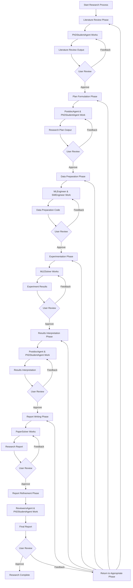

# Agent Laboratory Documentation

## Table of Contents

- [📚 Introduction](#introduction)
  - [Purpose and Goals](#purpose-and-goals)
  - [Key Features](#key-features)
- [👨‍💻 End-User Guide](#end-user-guide)
  - [⚙️ Installation](#installation)
  - [🔧 Configuration](#configuration)
  - [🚀 Running Research Projects](#running-research-projects)
  - [💡 Tips for Effective Use](#tips-for-effective-use)
  - [❓ Troubleshooting](#troubleshooting)
- [🏗️ Developer Documentation](#developer-documentation)
  - [System Architecture](#system-architecture)
  - [Code Structure](#code-structure)
  - [🤖 Agent Roles in Detail](#agent-roles-in-detail)
  - [🧩 Specialized Solvers in Detail](#specialized-solvers-in-detail)
  - [🛠️ External Tools in Detail](#external-tools-in-detail)
  - [🔌 LLM Integration](#llm-integration)
- [📊 System Visualizations](#system-visualizations)
  - [Co-Pilot Mode Interaction Flow](#co-pilot-mode-interaction-flow)
  - [Eventstorming of Research Phases](#eventstorming-of-research-phases)
- [🔮 Future Directions](#future-directions)
  - [Limitations and Considerations](#limitations-and-considerations)
  - [Future Development](#future-development)

## 📚 Introduction

Agent Laboratory is an end-to-end autonomous research workflow system designed to assist human researchers in implementing their research ideas. It consists of specialized agents driven by Large Language Models (LLMs) that support the entire research process—from conducting literature reviews and formulating plans to executing experiments and writing comprehensive reports.

### Purpose and Goals

The primary purpose of Agent Laboratory is to augment human researchers by automating time-consuming aspects of the research process. It aims to:

- Streamline the research workflow from ideation to publication
- Automate repetitive tasks like literature review and code implementation
- Produce high-quality research artifacts (code, reports, visualizations)
- Allow researchers to focus on high-level direction and creative thinking
- Accommodate varying levels of computational resources and human involvement

### Key Features

- **End-to-end research automation**: Covers the complete research lifecycle
- **Multi-agent architecture**: Specialized agents with distinct roles collaborate on research tasks
- **Multiple LLM backend support**: Compatible with various LLM providers (OpenAI, DeepSeek)
- **Extensible framework**: Can be adapted to different research domains and methodologies
- **Human-in-the-loop capability**: Co-pilot mode allows for human guidance and intervention
- **Checkpointing system**: Progress can be saved and resumed at different stages
- **Multi-language support**: Can operate in various languages beyond English

## 👨‍💻 End-User Guide

This section provides comprehensive guidance for using Agent Laboratory as an end-user.

### ⚙️ Installation

#### Prerequisites

Before installing Agent Laboratory, ensure you have:

1. Python 3.12 (recommended)
2. pip (Python package manager)
3. Git
4. pdflatex (optional, for PDF compilation)
5. Valid API keys for LLM providers (OpenAI and/or DeepSeek)

#### Installation Steps

1. **Clone the Repository**:
   ```bash
   git clone git@github.com:SamuelSchmidgall/AgentLaboratory.git
   ```

2. **Set up Virtual Environment**:
   ```bash
   python -m venv venv_agent_lab
   source venv_agent_lab/bin/activate  # On Windows: venv_agent_lab\Scripts\activate
   ```

3. **Install Dependencies**:
   ```bash
   pip install -r requirements.txt
   ```

4. **Install pdflatex (Optional)**:
   If you want to enable LaTeX compilation to PDF:
   ```bash
   sudo apt install pdflatex  # On Ubuntu/Debian
   # For other platforms, install TeX Live or MiKTeX
   ```
   
   Note: If you cannot install pdflatex, you can still use Agent Laboratory by setting the `--compile-latex` flag to `false`.

### 🔧 Configuration

#### API Keys

Agent Laboratory requires API keys for accessing LLM services. You can provide these in two ways:

1. **Environment Variables**:
   ```bash
   export OPENAI_API_KEY="your_openai_api_key"
   export DEEPSEEK_API_KEY="your_deepseek_api_key"
   ```

2. **Command-line Arguments**:
   ```bash
   python ai_lab_repo.py --api-key "your_openai_api_key" --deepseek-api-key "your_deepseek_api_key"
   ```

#### Model Selection

You can specify which LLM backend to use:

```bash
python ai_lab_repo.py --llm-backend "o1-mini" --research-topic "Your research topic"
```

Available options include:
- "o1" (OpenAI flagship model)
- "o1-preview"
- "o1-mini"
- "gpt-4o"
- "deepseek-chat"

#### Other Configuration Options

Additional configuration options can be specified through command-line arguments:

- `--copilot-mode "true"`: Enables human interaction at each phase
- `--compile-latex "false"`: Disables LaTeX PDF compilation
- `--language "中文"`: Sets the operating language (default is English)
- `--num-papers-lit-review "5"`: Sets the number of papers to include in literature review
- `--mlesolver-max-steps "3"`: Sets the maximum number of optimization steps for MLESolver
- `--papersolver-max-steps "5"`: Sets the maximum number of optimization steps for PaperSolver

### 🚀 Running Research Projects

#### Basic Usage

To start a research project with Agent Laboratory:

```bash
python ai_lab_repo.py --api-key "API_KEY_HERE" --llm-backend "o1-mini" --research-topic "YOUR RESEARCH IDEA"
```

This will initiate the full research workflow, from literature review to report generation.

#### Co-Pilot Mode

To enable human interaction at each phase of the research process:

```bash
python ai_lab_repo.py --api-key "API_KEY_HERE" --llm-backend "o1-mini" --research-topic "YOUR RESEARCH IDEA" --copilot-mode "true"
```

In co-pilot mode, the system will pause after each phase and ask for human approval or feedback.

#### Without LaTeX Compilation

If you don't have pdflatex installed:

```bash
python ai_lab_repo.py --api-key "API_KEY_HERE" --llm-backend "o1-mini" --research-topic "YOUR RESEARCH IDEA" --compile-latex "false"
```

#### Using Checkpoints

Agent Laboratory automatically saves checkpoints at the end of each phase. To resume from a checkpoint:

```bash
python ai_lab_repo.py --api-key "API_KEY_HERE" --research-topic "YOUR RESEARCH IDEA" --llm-backend "o1-mini" --load-existing True --load-existing-path "state_saves/LOAD_PATH"
```

#### Non-English Operation

To run Agent Laboratory in another language:

```bash
python ai_lab_repo.py --api-key "API_KEY_HERE" --research-topic "YOUR RESEARCH IDEA (in your language)" --llm-backend "o1-mini" --language "中文"
```

### 💡 Tips for Effective Use

#### Writing Effective Notes

One of the most important ways to guide Agent Laboratory is through detailed notes. These notes can be added to the `task_notes_LLM` structure in `ai_lab_repo.py`:

```python
task_notes_LLM = [
    {"phases": ["plan formulation"],
     "note": "You should come up with a plan for TWO experiments."},
     
    {"phases": ["data preparation", "running experiments"],
     "note": "You are running on a MacBook laptop. You can use 'mps' with PyTorch"},
     
    {"phases": ["data preparation", "running experiments"],
     "note": "Generate figures with very colorful and artistic design."},
]
```

Effective notes should include:
- Compute resource information (GPUs, CPUs, storage limitations)
- Specific experiments to be performed
- Style preferences for visualizations
- API keys or access credentials (if needed)
- Size constraints or performance considerations

#### Choosing Appropriate Models

The choice of LLM model significantly impacts the quality of research outputs:

- More powerful models (o1, o1-preview) generally produce higher quality results but at higher cost
- For initial prototyping or exploration, consider using o1-mini or gpt-4o
- For final results or complex research tasks, consider using more capable models

A balanced approach is to use more efficient models for iterative phases and reserve powerful models for critical phases like plan formulation and report writing.

#### Handling Large Research Projects

For complex research projects:

1. **Break down into sub-topics**: Focus on one aspect at a time
2. **Increase literature review limits**: Use `--num-papers-lit-review` to include more papers
3. **Extend solver steps**: Increase `--mlesolver-max-steps` and `--papersolver-max-steps`
4. **Use checkpoints strategically**: Save after major phases and iterate as needed
5. **Leverage co-pilot mode**: Provide guidance at critical decision points

### ❓ Troubleshooting

#### Common Issues and Solutions

1. **API Errors** 🔑:
   - **Issue**: "No API key provided" or authentication errors
   - **Solution**: Check that your API keys are correctly set and have sufficient credits

2. **LaTeX Compilation Errors** 📄:
   - **Issue**: "Compilation failed" or missing PDF output
   - **Solution**: Run with `--compile-latex "false"` or install pdflatex

3. **Memory or Resource Limitations** 💾:
   - **Issue**: Slow performance or crashes during experimentation
   - **Solution**: Add notes to limit dataset size or model complexity

4. **Agent Getting Stuck** 🔄:
   - **Issue**: Agent repeating the same actions or not progressing
   - **Solution**: Use co-pilot mode to intervene, or restart from the last checkpoint

5. **Low-Quality Results** 📉:
   - **Issue**: Experiments or reports don't meet expectations
   - **Solution**: Try using a more capable LLM model or provide more detailed notes

#### Getting Help

If you encounter issues not covered here:

1. Check the project's GitHub repository for updates or known issues
2. Review the extensive notes in the codebase for hints
3. Contact the developers at [sschmi46@jhu.edu](mailto:sschmi46@jhu.edu)

Remember that Agent Laboratory is a research tool and results may vary based on the complexity of your research topic and the capabilities of the LLM models used.

## 🏗️ Developer Documentation

### System Architecture

Agent Laboratory follows a component-based architecture centered around a workflow orchestrator that coordinates specialized agents through a series of research phases.

#### Core Components

1. **LaboratoryWorkflow (ai_lab_repo.py)**: The central orchestrator that manages the research workflow, coordinates agent activities, and tracks progress through different phases.

2. **Agent Roles (agents.py)**: Specialized agents handling different aspects of the research process:
   - PhDStudentAgent: Literature reviews, planning, results interpretation
   - PostdocAgent: Research plan guidance, results interpretation
   - ProfessorAgent: Report writing oversight
   - MLEngineerAgent: Data preparation, experiments
   - SWEngineerAgent: Software implementation
   - ReviewersAgent: Report evaluation
   
   *See [Agent Roles in Detail](#agent-roles-in-detail) section for comprehensive descriptions*

3. **Specialized Solvers**:
   - MLESolver: Handles ML experimentation
   - PaperSolver: Generates research reports
   
   *See [Specialized Solvers in Detail](#specialized-solvers-in-detail) section for implementation details*

4. **External Tools**: Literature search, dataset discovery, code execution
   
   *See [External Tools in Detail](#external-tools-in-detail) section for implementation details*

5. **Support Utilities**: LLM integration, file operations, token management

#### Flow of Information

The research workflow progresses through sequential phases:

1. Literature Review → 2. Plan Formulation → 3. Experimentation (Data Preparation, Running Experiments) → 4. Results Interpretation → 5. Report Writing → 6. Report Refinement

*For detailed event sequences and data flows of each phase, see [Research Phases: Eventstorming](#research-phases-eventstorming)*

### Code Structure

#### Main Modules and Their Functions

1. **ai_lab_repo.py**
   - Contains the `LaboratoryWorkflow` class
   - Implements the main research workflow phases
   - Manages agent coordination
   - Provides command-line interface

2. **agents.py**
   - Defines the `BaseAgent` abstract class
   - Implements specialized agent roles
   - Handles agent communication protocols

3. **mlesolver.py**
   - Implements the `MLESolver` class for ML experimentation
   - Provides code generation, execution, and improvement mechanisms
   - Includes reward functions for evaluating code quality

4. **papersolver.py**
   - Implements the `PaperSolver` class for report generation
   - Handles LaTeX document construction and refinement
   - Includes section-specific guidance and templates

5. **tools.py**
   - Provides external tool integrations (ArxivSearch, HFDataSearch)
   - Implements safe code execution environment
   - Offers utilities for literature and dataset discovery

6. **utils.py**
   - Contains utility functions for file operations
   - Provides LaTeX compilation functionality
   - Implements token management utilities

7. **inference.py**
   - Handles LLM API interactions
   - Manages API keys and authentication
   - Implements cost tracking and estimation

8. **common_imports.py**
   - Centralizes import statements
   - Provides access to libraries for data science, ML, and NLP

#### Class Hierarchy

The system follows a layered architecture with class hierarchies for agents and commands:

1. **Agent Hierarchy**:
   - `BaseAgent`: Abstract base class for all agents
     - `PhDStudentAgent`: Implements literature review and participates in planning and interpretation
     - `PostdocAgent`: Directs planning and interpretation
     - `ProfessorAgent`: Handles report writing and README generation
     - `MLEngineerAgent`: Focuses on data preparation and experiments
     - `SWEngineerAgent`: Collaborates on data preparation
     - `ReviewersAgent`: Provides feedback on the final report

2. **Command Hierarchy**:
   - `Command`: Abstract base class for all commands
     - `Edit` / `PaperEdit`: Edits a portion of code or paper
     - `Replace` / `PaperReplace`: Replaces entire code or paper content
     - `Arxiv`: Searches for papers on arXiv

#### Key Interfaces

1. **Agent Interface**:
   - `inference()`: Processes inputs and generates responses
   - `reset()`: Clears agent state
   - `role_description()`: Defines the agent's role
   - `phase_prompt()`: Provides phase-specific prompts
   - `command_descriptions()`: Describes available commands
   - `context()`: Provides contextual information

2. **Command Interface**:
   - `docstring()`: Provides usage documentation
   - `execute_command()`: Executes the command
   - `matches_command()`: Checks if a string matches the command
   - `parse_command()`: Parses command arguments

3. **Solver Interface**:
   - `initial_solve()`: Initializes the solving process
   - `solve()`: Performs incremental improvements
   - `process_command()`: Handles command execution

### 🤖 Agent Roles in Detail

The Agent Laboratory implements a collaborative multi-agent architecture where each agent fulfills a specialized role. The table below summarizes each agent's responsibilities and implementation details:

| Agent | Primary Responsibilities | Implementation Details | Key Methods |
|-------|--------------------------|------------------------|-------------|
| **PhDStudentAgent** | • Literature reviews<br>• Research plan collaboration<br>• Data preparation<br>• Results interpretation<br>• Report writing assistance<br>• Reviewer feedback response | • Maintains literature review database<br>• Tracks participation phases<br>• Stores experiment and report information | • `add_review()`<br>• `format_review()`<br>• `requirements_txt()` |
| **PostdocAgent** | • Research plan direction<br>• Results interpretation guidance<br>• Expertise and critique | • High-level guidance focus<br>• Phase-specific context<br>• Stores plan and results information | • Phase-specific context providers<br>• Dialogue generation for PhD guidance |
| **ProfessorAgent** | • Report writing direction<br>• README documentation<br>• Academic oversight | • Active during report writing<br>• Stores report history<br>• Report writing specialized context | • `generate_readme()` |
| **MLEngineerAgent** | • Data preparation<br>• Dataset selection<br>• Experiment implementation<br>• Results visualization | • ML-focused implementation<br>• Collaborates with SWEngineer | • Phase-specific context<br>• Code generation support<br>• Dataset search |
| **SWEngineerAgent** | • Software implementation<br>• Code quality<br>• Engineering practices | • Software engineering focus<br>• Collaborates with MLEngineer | • Phase-specific context<br>• Code review support |
| **ReviewersAgent** | • Report evaluation<br>• Constructive feedback<br>• Quality scoring | • Simulates multiple reviewers<br>• Implements scoring system<br>• Academic review format | • `inference()` with multiple perspectives |

### 🧩 Specialized Solvers in Detail

The Agent Laboratory includes specialized solver components that handle complex research tasks. The table below summarizes these solvers:

| Solver | Core Functionality | Implementation Details | Key Components |
|--------|-------------------|------------------------|----------------|
| **MLESolver** | • Initial code generation<br>• Controlled execution<br>• Performance evaluation<br>• Iterative improvement<br>• Visualization generation | • Command-based interface<br>• LLM-based code generation<br>• Code version history<br>• Reward function<br>• Safety measures | • `initial_solve()`<br>• `solve()`<br>• `reflect_code()`<br>• `process_command()`<br>• `run_code()`<br>• `feedback()` |
| **PaperSolver** | • Paper scaffolding<br>• Section construction<br>• Results incorporation<br>• Iterative improvement<br>• LaTeX compilation | • Command-based interface<br>• Section-specific prompts<br>• Paper version history<br>• Quality scoring<br>• LaTeX error handling | • `initial_solve()`<br>• `solve()`<br>• `gen_initial_report()`<br>• `process_command()`<br>• `system_prompt()` |

### 🛠️ External Tools in Detail

The Agent Laboratory leverages several external tools to support the research process. The table below summarizes these tools:

| Tool | Features | Implementation Details | Key Methods |
|------|----------|------------------------|-------------|
| **ArxivSearch** | • Semantic paper search<br>• Metadata retrieval<br>• Full-text extraction<br>• Query optimization | • Uses arxiv library<br>• PDF text extraction<br>• Rate limit handling<br>• Query processing | • `find_papers_by_str()`<br>• `retrieve_full_paper_text()`<br>• `_process_query()` |
| **HFDataSearch** | • Dataset semantic search<br>• Popularity filtering<br>• Dataset property analysis<br>• Detailed information retrieval | • Uses HF datasets library<br>• TF-IDF vectorization<br>• Multi-factor normalization<br>• Detailed formatting | • `retrieve_ds()`<br>• `results_str()`<br>• `_normalize()` |
| **Code Execution Environment** | • Sandboxed execution<br>• Timeout enforcement<br>• Error capture<br>• Output formatting<br>• Resource limitations | • ThreadPoolExecutor<br>• Timeout mechanisms<br>• stdout/stderr capture<br>• Safety protections<br>• Output size limits | • `execute_code()`<br>• matplotlib support<br>• Error handling |

### 🔌 LLM Integration

Agent Laboratory is designed to work with multiple Large Language Model providers, with a unified interface for all LLM interactions.

#### Supported Models

The system currently supports the following LLM backends:

1. **OpenAI Models**:
   - o1 (flagship model)
   - o1-preview
   - o1-mini
   - gpt-4o

2. **DeepSeek Models**:
   - deepseek-chat (deepseek-v3)

#### API Handling

The LLM integration is implemented in `inference.py` with the following features:

- **Unified Interface**: The `query_model()` function provides a consistent interface for all LLM providers
- **Authentication Management**: Handles API keys through environment variables or direct parameters
- **Error Handling**: Implements retry logic for API failures with configurable timeout
- **Temperature Control**: Allows adjustment of LLM response randomness
- **Response Parsing**: Standardizes response handling across different providers

**Implementation Details**:
```python
def query_model(model_str, prompt, system_prompt, openai_api_key=None, 
                anthropic_api_key=None, tries=5, timeout=5.0, temp=None, 
                print_cost=True, version="1.5"):
    # Authentication handling
    # API calls with appropriate parameters
    # Error handling and retries
    # Response standardization
```

#### Cost Management

The system includes sophisticated cost tracking and estimation features:

- **Token Counting**: Tracks input and output tokens for each model
- **Cost Calculation**: Uses model-specific pricing to estimate running costs
- **Usage Reporting**: Provides ongoing cost estimates during execution

**Implementation Details**:
```python
def curr_cost_est():
    costmap_in = {
        "gpt-4o": 2.50 / 1000000,
        "gpt-4o-mini": 0.150 / 1000000,
        "o1-preview": 15.00 / 1000000,
        "o1-mini": 3.00 / 1000000,
        # Additional models...
    }
    costmap_out = {
        "gpt-4o": 10.00/ 1000000,
        "gpt-4o-mini": 0.6 / 1000000,
        "o1-preview": 60.00 / 1000000,
        "o1-mini": 12.00 / 1000000,
        # Additional models...
    }
    return sum([costmap_in[_]*TOKENS_IN[_] for _ in TOKENS_IN]) + 
           sum([costmap_out[_]*TOKENS_OUT[_] for _ in TOKENS_OUT])
```

#### Model Configuration

Agent Laboratory allows for granular configuration of LLM usage:

- **Phase-Specific Models**: Different models can be specified for different research phases
- **Model Selection**: Command-line interface for specifying the primary LLM backend
- **Version Compatibility**: Supports different versions of provider APIs

## 📊 System Visualizations

### Co-Pilot Mode Interaction Flow

This diagram illustrates how user interactions occur in co-pilot mode:



### Eventstorming of Research Phases

This section provides a detailed walkthrough of the entire research workflow in Agent Laboratory, presented in an Eventstorming format that traces the process from initial user input to final output.

#### Overview of the Workflow

The research process in Agent Laboratory is organized into sequential phases:

```
[User Input] → [📖 Literature Review] → [📝 Plan Formulation] → [🔍 Data Preparation] 
→ [🧪 Running Experiments] → [📊 Results Interpretation] → [📄 Report Writing] 
→ [✏️ Report Refinement] → [Final Output]
```

Each phase involves specific agents, produces certain artifacts, and may include user interaction points (especially in co-pilot mode). Let's examine each phase in detail.

#### 📖 Literature Review Phase

**Purpose**: Gather and analyze relevant research papers to establish the current state of knowledge on the research topic.

**Agents Involved**:
- Primary: PhDStudentAgent

**Data Flow**:
1. **Input**: Research topic from user
2. **Process**:
   - PhDStudentAgent generates search queries based on the topic
   - ArxivSearch tool retrieves paper summaries
   - PhDStudentAgent reviews papers and selects relevant ones
   - Full text of selected papers is retrieved and analyzed
   - PhDStudentAgent creates summaries and adds them to the literature review
3. **Output**: Literature review summary stored in PhDStudentAgent's state

**Event Sequence**:
```
UserInputProvided → 
  PhDStudentActivated →
    SearchQueryGenerated →
    ArxivSearchExecuted →
    PaperSummariesReviewed →
    RelevantPapersIdentified →
    FullTextRetrieved →
    PaperAnalyzed →
    PaperSummaryCreated →
    [Repeat for multiple papers] →
  LiteratureReviewCompiled →
  UserApprovalRequested (if in co-pilot mode) →
LiteratureReviewPhaseCompleted
```

**User Interaction** (Co-pilot Mode):
- After the literature review is compiled, the user is presented with the compiled review
- User can approve the review or provide feedback for improvements
- If feedback is provided, the PhDStudentAgent will incorporate it and restart the phase

**Artifacts Produced**:
- Literature review database in PhDStudentAgent's state
- Formatted literature review summary

**Transition**:
Upon completion, the workflow progresses to the Plan Formulation phase, passing the literature review summary as context.

#### 📝 Plan Formulation Phase

**Purpose**: Develop a comprehensive research plan based on the literature review.

**Agents Involved**:
- Primary: PostdocAgent
- Secondary: PhDStudentAgent

**Data Flow**:
1. **Input**: Literature review summary from Phase 1
2. **Process**:
   - PostdocAgent guides the discussion on potential research approaches
   - PhDStudentAgent contributes ideas based on the literature review
   - Both agents engage in dialogue to refine the plan
   - PostdocAgent finalizes the research plan
3. **Output**: Structured research plan

**Event Sequence**:
```
LiteratureReviewPhaseCompleted →
  PostdocAgentActivated →
  PhDStudentAgentActivated →
    DialogueInitiated →
    ResearchApproachesDiscussed →
    PlanDrafted →
    PlanRefined →
  PlanFinalized →
  UserApprovalRequested (if in co-pilot mode) →
PlanFormulationPhaseCompleted
```

**User Interaction** (Co-pilot Mode):
- After the plan is finalized, the user is presented with the research plan
- User can approve the plan or provide feedback for improvements
- If feedback is provided, the agents will incorporate it and restart the phase

**Artifacts Produced**:
- Structured research plan including:
  - Research objectives
  - Methodology
  - Proposed experiments
  - Expected outcomes

**Transition**:
Upon completion, the workflow progresses to the Data Preparation phase, passing the research plan as context.

#### 🔍 Data Preparation Phase

**Purpose**: Find and prepare suitable datasets for the proposed experiments.

**Agents Involved**:
- Primary: MLEngineerAgent
- Secondary: SWEngineerAgent

**Data Flow**:
1. **Input**: Research plan from Phase 2
2. **Process**:
   - MLEngineerAgent analyzes the plan to determine data requirements
   - HFDataSearch tool is used to find relevant datasets
   - MLEngineerAgent drafts code for data loading and preprocessing
   - SWEngineerAgent reviews and refines the code
   - Code is executed to verify correct operation
3. **Output**: Functional code for dataset loading and preparation

**Event Sequence**:
```
PlanFormulationPhaseCompleted →
  MLEngineerAgentActivated →
  SWEngineerAgentActivated →
    DataRequirementsAnalyzed →
    HFDataSearchExecuted →
    DatasetsEvaluated →
    OptimalDatasetSelected →
    DataLoadingCodeDrafted →
    CodeExecuted →
    ExecutionResultsEvaluated →
    CodeRefined →
  FinalDataPreparationCodeSubmitted →
  UserApprovalRequested (if in co-pilot mode) →
DataPreparationPhaseCompleted
```

**User Interaction** (Co-pilot Mode):
- After data preparation code is finalized, the user is presented with the code
- User can approve the code or provide feedback for improvements
- If feedback is provided, the agents will incorporate it and restart the phase

**Artifacts Produced**:
- Python code for dataset loading and preprocessing
- Documentation of selected datasets

**Transition**:
Upon completion, the workflow progresses to the Running Experiments phase, passing the data preparation code as context.

#### 🧪 Running Experiments Phase

**Purpose**: Implement and execute the experiments outlined in the research plan.

**Agents Involved**:
- Primary: Specialized MLESolver

**Data Flow**:
1. **Input**: Research plan and data preparation code
2. **Process**:
   - MLESolver generates initial code implementation
   - Code is executed in a controlled environment
   - Results are evaluated using a reward function
   - MLESolver iteratively improves the code through edits
   - Visualizations and figures are generated
3. **Output**: Experimental code, results, and visualizations

**Event Sequence**:
```
DataPreparationPhaseCompleted →
  MLESolverActivated →
    InitialCodeImplemented →
    CodeExecuted →
    ResultsEvaluated →
    CodeImproved →
    [Repeated for multiple iterations] →
    VisualizationsGenerated →
  ExperimentResultsCompiled →
  UserApprovalRequested (if in co-pilot mode) →
RunningExperimentsPhaseCompleted
```

**User Interaction** (Co-pilot Mode):
- After experiments are completed, the user is presented with the code and results
- User can approve the results or provide feedback for improvements
- If feedback is provided, the MLESolver will incorporate it and restart the phase

**Artifacts Produced**:
- Python code implementing the experiments
- Experimental results data
- Visualizations (Figure_1.png, Figure_2.png, etc.)

**Transition**:
Upon completion, the workflow progresses to the Results Interpretation phase, passing the experimental code, results, and visualizations as context.

#### 📊 Results Interpretation Phase

**Purpose**: Analyze and interpret the experimental results.

**Agents Involved**:
- Primary: PostdocAgent
- Secondary: PhDStudentAgent

**Data Flow**:
1. **Input**: Experimental code, results, and visualizations
2. **Process**:
   - PostdocAgent leads the discussion on interpreting the results
   - PhDStudentAgent contributes insights based on the literature and experiments
   - Both agents engage in dialogue to develop a comprehensive interpretation
   - Interpretation is formalized in a structured format
3. **Output**: Formal interpretation of experimental results

**Event Sequence**:
```
RunningExperimentsPhaseCompleted →
  PostdocAgentActivated →
  PhDStudentAgentActivated →
    DialogueInitiated →
    ResultsAnalyzed →
    LiteratureContextApplied →
    InterpretationDeveloped →
    ImplicationsDiscussed →
  InterpretationFinalized →
  UserApprovalRequested (if in co-pilot mode) →
ResultsInterpretationPhaseCompleted
```

**User Interaction** (Co-pilot Mode):
- After the interpretation is finalized, the user is presented with the interpretation
- User can approve the interpretation or provide feedback for improvements
- If feedback is provided, the agents will incorporate it and restart the phase

**Artifacts Produced**:
- Formal interpretation document including:
  - Summary of key findings
  - Analysis of experimental results
  - Comparison with existing literature
  - Discussion of implications

**Transition**:
Upon completion, the workflow progresses to the Report Writing phase, passing the interpretation as context along with all previous artifacts.

#### 📄 Report Writing Phase

**Purpose**: Generate a comprehensive research report in LaTeX format.

**Agents Involved**:
- Primary: Specialized PaperSolver

**Data Flow**:
1. **Input**: All previous artifacts (literature review, plan, code, results, interpretation)
2. **Process**:
   - PaperSolver generates initial paper scaffolding
   - Paper sections are constructed one by one:
     - Abstract
     - Introduction
     - Background/Related Work
     - Methods
     - Experimental Setup
     - Results
     - Discussion
   - LaTeX document is iteratively improved
   - Figures and tables are incorporated
   - LaTeX is compiled to PDF (if enabled)
3. **Output**: Complete research report in LaTeX format and PDF (if compilation enabled)

**Event Sequence**:
```
ResultsInterpretationPhaseCompleted →
  PaperSolverActivated →
    PaperScaffoldGenerated →
    AbstractWritten →
    IntroductionWritten →
    BackgroundWritten →
    RelatedWorkWritten →
    MethodsWritten →
    ExperimentalSetupWritten →
    ResultsWritten →
    DiscussionWritten →
    FiguresIncorporated →
    LaTeXCompiled →
  ReportFinalized →
  UserApprovalRequested (if in co-pilot mode) →
ReportWritingPhaseCompleted
```

**User Interaction** (Co-pilot Mode):
- After the report is finalized, the user is presented with the LaTeX and/or PDF
- User can approve the report or provide feedback for improvements
- If feedback is provided, the PaperSolver will incorporate it and restart the phase

**Artifacts Produced**:
- Complete LaTeX document
- PDF report (if LaTeX compilation is enabled)
- README.md generated by ProfessorAgent

**Transition**:
Upon completion, the workflow progresses to the Report Refinement phase, passing the report as context.

#### ✏️ Report Refinement Phase

**Purpose**: Evaluate and potentially improve the research report based on reviewer feedback.

**Agents Involved**:
- Primary: ReviewersAgent
- Secondary: PhDStudentAgent

**Data Flow**:
1. **Input**: Research report from Phase 6
2. **Process**:
   - ReviewersAgent generates reviews from multiple reviewer perspectives
   - PhDStudentAgent evaluates the reviews and decides whether to accept or revise
   - If revision is needed, the workflow returns to an earlier phase
3. **Output**: Final research report or decision to iterate

**Event Sequence**:
```
ReportWritingPhaseCompleted →
  ReviewersAgentActivated →
    MultipleReviewsGenerated →
    ReviewsAnalyzed →
  PhDStudentAgentActivated →
    RevisionDecisionMade →
    UserApprovalRequested (if in co-pilot mode) →
  [If revision needed, return to appropriate previous phase] →
ReportRefinementPhaseCompleted
```

**User Interaction** (Co-pilot Mode):
- After reviews are generated, the user is presented with the reviews
- User decides whether to accept the report or request revisions
- If revisions are requested, the user helps determine which phase to return to

**Artifacts Produced**:
- Reviewer feedback
- Final research artifacts:
  - LaTeX report
  - PDF report (if LaTeX compilation is enabled)
  - README.md
  - Source code
  - Experimental results

**Transition**:
Upon completion, the entire research workflow is finalized, and all artifacts are available in the `research_dir` directory.

## 🔮 Future Directions

- **Ethical Considerations** 🔬: Automated research tools raise important questions about authorship, attribution, and the responsible use of AI in scientific discovery.

### Future Development

Agent Laboratory represents an early step in the evolution of AI-assisted research. Future developments may include:

- Integration with more specialized research tools and databases 🔗
- Support for additional LLM backends as new models emerge 🤖
- Enhanced domain-specific capabilities for fields like healthcare, physics, or social sciences 🔬
- Improved mechanisms for capturing and incorporating human expertise 👥
- More sophisticated multi-agent collaboration patterns 🔄

By combining the creativity and guidance of human researchers with the efficiency and scalability of AI agents, Agent Laboratory points toward a future where AI becomes an indispensable partner in scientific discovery, helping researchers to explore more ideas, conduct more thorough analyses, and communicate their findings more effectively.

As the system continues to evolve, it has the potential to democratize research capabilities, making sophisticated research methodologies accessible to a wider range of practitioners and potentially accelerating the pace of scientific advancement across multiple disciplines.
